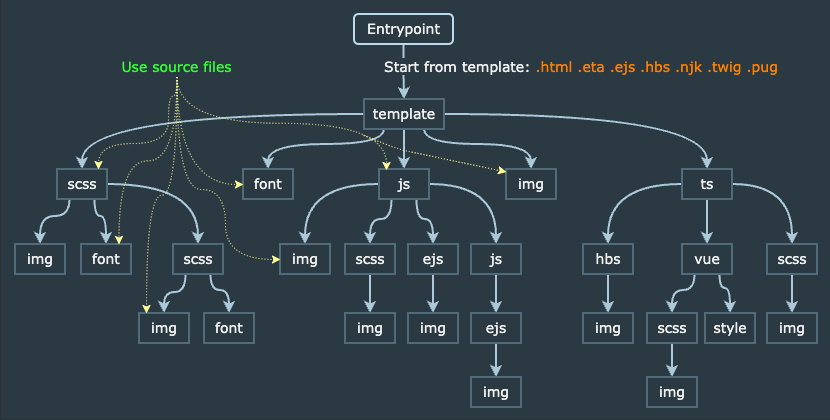
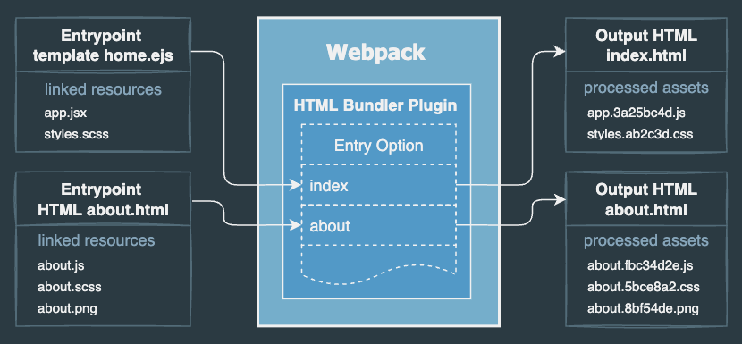

# Introduction

> :::info
> This plugin is all you need to generate a complete single- or multi-page website from your source assets.

The plugin automates the processing of source files such as JS/TS, SCSS, images and other assets referenced in an HTML or template file.
This plugin will generate an HTML file containing all the necessary links to JS, CSS, images and other resources.

## Key Features

- An [entry point](/plugin-options-entry) is any HTML template. **Start from HTML or template**, not from JS.
- **Automatically** processes templates found in the [entry directory](/plugin-options-entry#template-directory-reference).
- Build-in support for [template engines](/category/template-engines): [Eta](/guides/preprocessor/eta), [EJS](/guides/preprocessor/ejs), [Handlebars](/guides/preprocessor/handlebars), [Nunjucks](/guides/preprocessor/nunjucks), [Pug](/guides/preprocessor/pug), [Tempura](/guides/preprocessor/tempura), [TwigJS](/guides/preprocessor/twig), [LiquidJS](/guides/preprocessor/liquid).
- Build-in support for **Markdown** `*.md` files in templates, see [Markdown demo](https://stackblitz.com/edit/markdown-to-html-webpack?file=webpack.config.js) in browser.
- Allows to [pass data](/plugin-options-entry#entrydescriptiondata) into a template.
- **Resolve** [source files](/plugin-options-sources) of [`scripts`](/plugin-options-js), [`styles`](/plugin-options-css), images and other assets in HTML:
  - `<link href="./style.scss" rel="stylesheet">`
  - ``
  - `<link href="../images/favicon.svg" type="image/svg" rel=icon />`
  - ``\
    Resolved assets will be processed and replaced with correct URLs in the generated HTML.
- **Resolve** references to source files of fonts, images in CSS:
  - `@font-face { src: url('@fonts/monaco.woff2') ... }`
  - `background-image: url(../images/picture.png);`\
    Resolved assets will be processed and replaced with correct URLs in the generated CSS, without using [resolve-url-loader](https://github.com/bholloway/resolve-url-loader).
- **Resolve** [route URLs](/plugin-options-router) in `a.href`, useful for navigation in multi-pages.
- **Inline** [JS](/guides/inline-js), [CSS](/guides/inline-css) and [Images](/guides/inline-images) into HTML. See [how to inline all resources](/guides/inline-all-assets) into single HTML file.
- Supports importing styles in JavaScript.
- Supports styles used in `*.vue`.
- Supports the [HMR for CSS](/plugin-options-css) to update CSS in browser without a full reload.
- Watches for changes in the [data file](/plugin-options-entry#entrydescriptiondata) linked to the template in the plugin option.
- Generates the [preload](/plugin-options-preload) tags for fonts, images, video, scripts, styles.
- Generates the [integrity](/plugin-options-integrity) attribute in the `link` and `script` tags.
- Generates the [favicons](/Plugins/favicons) of different sizes for various platforms.
- Minimizes generated HTML.
- You can create custom plugins using the provided [Plugin Hooks](/hooks-and-callbacks).
- Over 700 [tests](https://github.com/webdiscus/html-bundler-webpack-plugin/tree/master/test) for various use cases.

## HTML template as entry point

The **HTML Bundler** generates static HTML or [template function](/guides/preprocessor/template-function) from [various templates](/category/template-engines) containing source files of scripts, styles, images, fonts and other resources, similar to how it works in [Vite](https://vitejs.dev/guide/#index-html-and-project-root).
This plugin looks at the template files in [entry option](/plugin-options-entry) to start building the bundle.
The [source files](/plugin-options-sources) of dependencies (scripts, styles, etc.) can be defined directly in the template.

The plugin **resolves source files** of assets in templates and replaces them with correct output URLs in the generated HTML.
The resolved assets will be processed via Webpack plugins/loaders and placed into the output directory.
You can use a relative path or Webpack alias to a source file.

A template imported in JS will be compiled into [template function](/guides/preprocessor/template-function). You can use the **template function** in JS to render the template with variables in runtime on the client-side in the browser.

## How the plugin works

The plugin resolves references in the HTML template and adds them to the Webpack compilation.
Webpack will automatically process the source files, and the plugin replaces the references with their output filenames in the generated HTML.
See [how the plugin works under the hood](/hooks-and-callbacks).

## Why use the HTML Bundler Plugin?

This plugin is a powerful alternative to [html-webpack-plugin](https://github.com/jantimon/html-webpack-plugin) and a replacement for many [plugins and loaders](#related-plugins-and-loaders).

The HTML Bundler Plugin works a bit differently than `html-webpack-plugin`.
It doesn't just inject JavaScript and CSS into an HTML.
Instead, it resolves all the source files of the assets referenced directly in the template
and ensures the generated HTML contains the correct output URLs of resources after Webpack processes them.
Additionally, CSS extracted from styles imported in JS can be injected into HTML as a `<link>` tag or as an inlined CSS.

## Why do developers migrate from Webpack?

In recent years, many developers have started migrating to alternatives like **Vite**.
The reasons are clear: configuration complexity, developer experience, and build speed.

### Complexity in Configuration

One of the biggest pain points with Webpack is its verbose and complex configuration, 
especially when handling HTML files and assets. 
Traditionally, developers uses multiple plugins and loaders just to render their HTML templates, 
inject scripts, and optimize assets.

The `html-bundler-webpack-plugin` solves this problem by simplifying the entire HTML bundling process:
- Supports HTML templates like EJS, Handlebars, Pug, and many others "out of the box".
- Resolves references to source assets in HTML, such as JavaScript/TypeScript, CSS/SCSS, images, fonts, and other resources.
- Automatically injects processed assets into HTML without extra plugins and loaders.
- Generates the preload tags, integrity attribute, favicons of different sizes.
- Minimizes generated HTML for production with built-in features.

With `html-bundler-webpack-plugin`, Webpack setup becomes much simpler and clear, 
without complex HTML handling configurations, making Webpack more intuitive.

### Related plugins and loaders

Just one plugin replaces the functionality of the plugins and loaders:

| Package                                                                                                 | Description                                     |
|---------------------------------------------------------------------------------------------------------|-------------------------------------------------|
| [html-webpack-plugin](https://github.com/jantimon/html-webpack-plugin)                                  | creates HTML and injects `script` tag into HTML |
| [mini-css-extract-plugin](https://github.com/webpack-contrib/mini-css-extract-plugin)                   | extracss CSS and injects `link` tag into HTML   |
| [webpack-remove-empty-scripts](https://github.com/webdiscus/webpack-remove-empty-scripts)               | removes generated empty JS files                |
| [html-loader](https://github.com/webpack-contrib/html-loader)                                           | resolves tag attributes, exports HTML           |
| [style-loader](https://github.com/webpack-contrib/style-loader)                                         | injects an inline CSS into HTML                 |
| [html-webpack-inject-preload](https://github.com/principalstudio/html-webpack-inject-preload)           | inject preload link tags                        |
| [preload-webpack-plugin](https://github.com/vuejs/preload-webpack-plugin)                               | inject preload link tags                        |
| [html-webpack-inline-source-plugin](https://github.com/dustinjackson/html-webpack-inline-source-plugin) | inline JS and CSS into HTML                     |
| [html-inline-css-webpack-plugin](https://github.com/runjuu/html-inline-css-webpack-plugin)              | inline CSS into HTML                            |
| [posthtml-inline-svg](https://github.com/andrey-hohlov/posthtml-inline-svg)                             | injects an inline SVG icon into HTML            |
| [resolve-url-loader](https://github.com/bholloway/resolve-url-loader)                                   | resolves a relative URL in CSS                  |
| [svg-url-loader](https://github.com/bhovhannes/svg-url-loader)                                          | encodes a SVG data-URL as utf8                  |
| [webpack-subresource-integrity ](https://www.npmjs.com/package/webpack-subresource-integrity)           | enables Subresource Integrity                   |
| [favicons-webpack-plugin ](https://github.com/jantimon/favicons-webpack-plugin)                         | generates favicons and icons                    |
| [handlebars-webpack-plugin](https://github.com/sagold/handlebars-webpack-plugin)                        | renders Handlebars templates                    |
| [handlebars-loader](https://github.com/pcardune/handlebars-loader)                                      | compiles Handlebars templates                   |
| [pug-loader](https://www.npmjs.com/package/pug-loader)          | compiles Pug templates                          |
| [nunjucks-loader](https://github.com/at0g/nunjucks-loader)          | compiles Nunjucks templates                     |

### Improved Developer Experience

By using this plugin, Webpack can offer a modern developer experience (DX) comparable to Vite, 
while still providing the powerful features it is known for.

### Build Speed and Performance

Yes, Webpack is slower than Vite, but that comes with the reasons:

- **More Flexibility** – Webpack is highly configurable, allowing fine-tuned optimizations that other bundlers don’t support.
- **Feature-Rich** – Webpack handles complex builds, including custom loaders, asset processing, and advanced optimizations.
- **Extensive Plugin Ecosystem** – Webpack has a massive collection of plugins that extend its functionality, making it suitable for large and unique projects.
- **Performance Improvements Exist** – While Webpack may not match Vite’s speed, it offers caching, tree-shaking, and code-splitting to optimize builds.
- **Still Ideal for Large Projects** – Many enterprise applications continue using Webpack because of its power and ecosystem.
